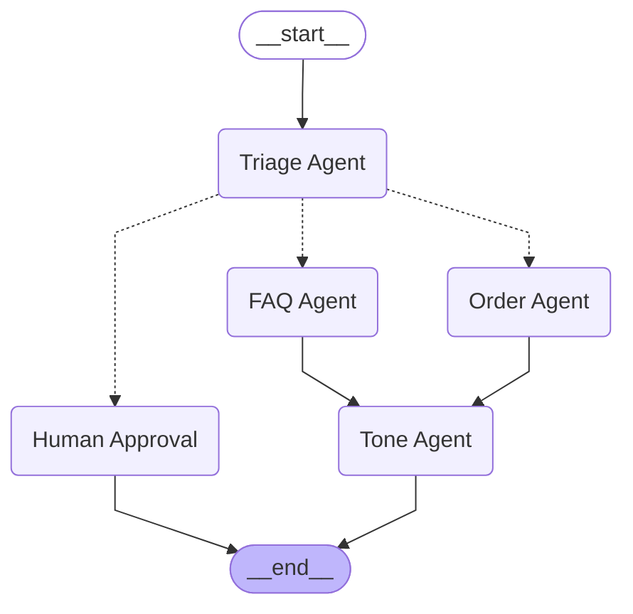
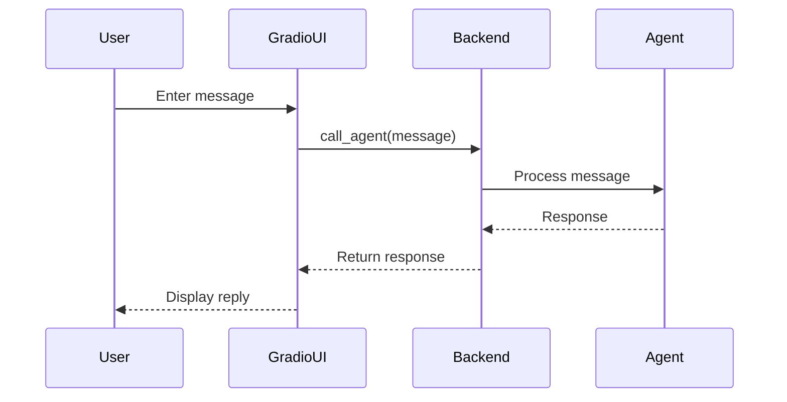

# Vibe-Coded Customer Service Agent (MVP)

## 1. Initial Architecture Overview

### System Flow (Mermaid Diagram)


### Sequence Diagram


## 2. Code Structure and Layout

```
code/1-initial-setup/
├── backend.py           # Backend API for agent communication
├── constants.py         # Constants used in the system
├── edges.py             # Graph edges (if any)
├── graph.py             # Graph logic (if any)
├── order_mcp_server.py  # Order management server
├── state.py             # State management
├── ui_gradio.py         # Gradio web UI
├── agents/              # Agent implementations
│   ├── __init__.py
│   ├── faq_agent.py
│   ├── order_agent.py
│   ├── tone_agent.py
│   └── triage_agent.py
├── tools/               # Tool implementations
│   ├── __init__.py
│   └── order_tool.py
└── README.md            # Documentation
```

## 3. Steps to Run the Application

1. Start the order management server:
   ```cmd
   python code/1-initial-setup/order_mcp_server.py
   ```
2. Start the backend agent API:
   ```cmd
   python code/1-initial-setup/backend.py
   ```
3. Launch the Gradio UI:
   ```cmd
   python code/1-initial-setup/ui_gradio.py
   ```

## 4. Talk Track & Demo Inputs

- Example Inputs to Try:
  - "Where is my order?"
  - "Where is my order #ORD-123?"
  - "I need a refund."
  - "Can I speak to a human?"

- Key Points:
  - Demonstrate how quickly an MVP can be built using prompt-driven coding.
  - Highlight the ease of running locally and the lack of engineering rigor.
  - Discuss "vibe-coding"—fast prototyping without production-grade robustness.

## 5. Simulating Production-Grade Issues

We will introduce and simulate real production issues, such as:
- **Error Handling Failures:** What happens if the backend API is down?
- **Scalability Bottlenecks:** Only one user at a time, no concurrency.
- **Security Gaps:** No authentication, possible PII exposure.
- **Lack of Monitoring & Observability:** No way to track or debug issues.
- **Missing Guardrails:** Unsafe or non-compliant outputs possible.
- **No Explainability or Audit Trails:** No record of decisions or actions.

Each problem will be demonstrated, then fixed step-by-step, showing the transition from MVP to a production-grade system.

---

Stay tuned for each engineering upgrade and its impact on reliability, safety, and scalability. This journey will show the difference between a quick demo and a robust, scalable, and secure agentic AI system ready for real-world deployment.
