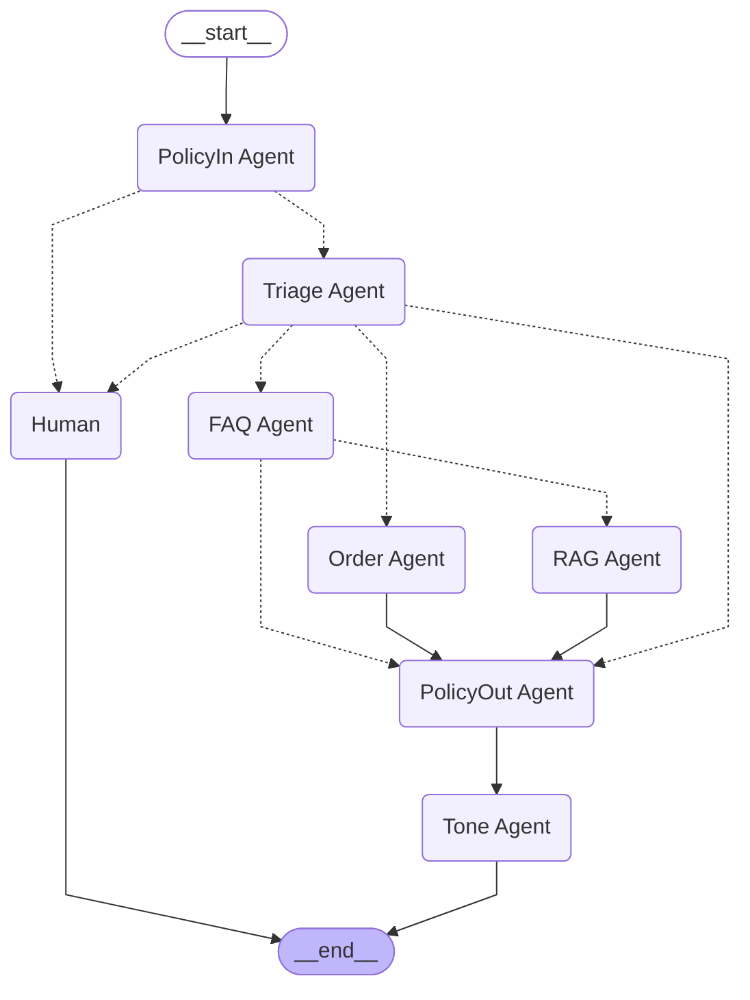

# Production-Grade Guardrails & Policy Enforcement: Step-by-Step Engineering Journey

## Context & Journey So Far
We started with a basic MVP ("vibe-coded") agentic AI system, then enhanced it with observability and monitoring in `2-observability`, `HITL&State Management`. In `3-rag`, we focused on building a production-grade Retrieval-Augmented Generation (RAG) system with explainability and evaluation.  
**Now, in `4-guardrails`, we add robust policy enforcement and guardrails to ensure safety, compliance, and trust at scale.**

## Architecture Reference
The system architecture now includes:
- Channels (Web, Mobile, Email)
- API Gateway
- Supervisor/Router Agent
- Specialized Agents (RAG, Action, Empathy, Policy, Summarizer)
- **Policy Agent (NEW): Moderation, PII detection/redaction, escalation**
- Guardrails (Moderation, PII filter, Channel Formatter)
- Observability & Traces
- Human-in-the-Loop (HTL) for escalation

## Mermaid Diagram


## Focus Areas for Production-Grade Guardrails
- **Moderation:** All user input and agent output are checked for toxicity, violence, self-harm, and harassment using the OpenAI Moderation API.
- **PII Detection & Redaction:** Presidio is used to detect and redact personally identifiable information (PII) in both input and output.
- **Policy Enforcement:** Unsafe or non-compliant content is blocked, redacted, or escalated to a human agent.
- **Traceability & Auditing:** All policy decisions are logged in the system state for observability and compliance.
- **Human Escalation:** Inputs or outputs that cannot be safely handled by the AI are routed to a human agent for review.

## Step 1: Integrating the Policy Agent
The new `PolicyAgent` is integrated at both the input and output stages of the agent workflow:
- **Input:** Blocks or escalates unsafe user messages before any further processing.
- **Output:** Redacts or blocks unsafe agent responses before they reach the user.
- **All decisions are structured and auditable, supporting production-grade compliance.**

### Hands-On Instructions
1. **Install dependencies** (if not already done):
   ```cmd
   uv sync
   ```
2. **Run the application** as before. The policy agent is now active by default.
3. **Test with unsafe or PII-containing input/output** to see the guardrails in action.

---

## Before & After (Talk Track)
**Before:**
- The system could inadvertently process or output unsafe, toxic, or PII-containing content.
- No systematic way to enforce compliance or safety.
- No traceability or audit trail for policy decisions.

**After:**
- Every user input and agent output is checked for policy violations and PII.
- Unsafe content is redacted, blocked, or escalated to a human.
- All decisions are logged for traceability and auditing.
- The system is now robust, compliant, and production-ready for real-world deployment.

---

## Next Step
Try out the system with various inputs (including unsafe, toxic, or PII-containing messages) and observe how the policy agent enforces guardrails.  
You can review the structured policy decisions in the system state for each request.  
This step lays the foundation for further enhancements in explainability, continuous evaluation, and advanced compliance.
